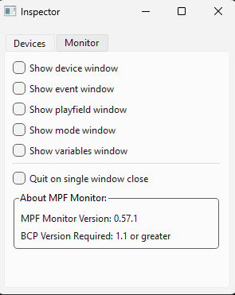
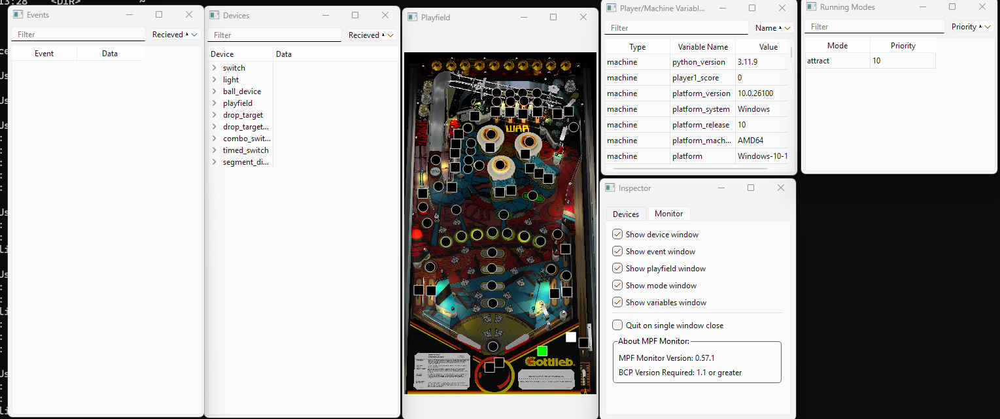

# MPF Monitor

## Rôle du MPF Monitor

**Surveillance en direct** : Le MPF Monitor affiche des informations en temps réel sur l'état de la machine à flipper. Il montre les entrées, les sorties, les événements, et les changements d'état, ce qui est utile pour diagnostiquer des problèmes ou comprendre comment la machine réagit à différents événements.

**Visualisation des événements** : Chaque événement généré dans la machine peut être visualisé, ce qui permet de voir quels capteurs ont été activés, quels événements ont été déclenchés, ou encore quels objets du jeu (comme les lumières ou les bobines) ont réagi.

**Débogage** : En plus de surveiller, le MPF Monitor permet de tester et de simuler des entrées sans avoir à activer physiquement les composants du flipper. Cela permet aux développeurs de tester des configurations et des comportements sans avoir la machine à disposition.

**Personnalisation des informations** : Les utilisateurs peuvent choisir quelles informations ils veulent surveiller (par exemple, certaines lumières, switches, ou événements) pour se concentrer sur les aspects critiques du développement ou du débogage.

**Logs et historique** : Il garde une trace des événements passés, ce qui est très utile pour analyser un comportement ou pour revenir sur une situation précise après que la machine a rencontré un problème.

## Installation
Pour installer mpf monitor taper dans votre environnement virtuel python :

    pip install mpf-monitor --pre

Créer ensuite un dossier monitor dans votre projet dans lequel vous déposerez une image de votre plateau que vous nommerez : playfield.jpg

## Utilisation

Une fois le monitor lancé avec la commande `mpf monitor` (il faut lancer mpf en parallèle) vous pouvez afficher différentes fenêtres, nous commençons par afficher playfield et la fenêtre device.

Dans la fenêtre devices, sélectionner chaque périphérique (switch, lampe..) et faites le glisser sur le playfield pour le positionner sur l'image. Les modifications sont alors enregistrées dans le fichier monitor.yaml.

On peut voir sur la capture suivante, le switch du chargeur de bille actif en vert.

Dans les autres fenêtres vous avez la possibilité de voir les évènements, les variables et les modes actifs.

