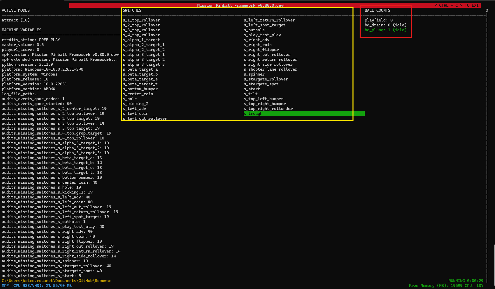

# Lancement de partie

Pour pouvoir lancer une partie, il y a quelques paramètres à définir.

Le nombre de balles par exemple (dans la section [game](https://missionpinball.org/latest/config/game/) du config.yaml):

	game:
		balls_per_game: 3
		
On peut aussi fixer dans cette section le nombre de joueurs max avec ma variable : max_players.

Ensuite nous allons définir des [ball_devices](https://missionpinball.org/latest/config/ball_devices/). La section ball_devices est utilisée pour définir et configurer les dispositifs physiques qui interagissent avec les billes dans un flipper, tels que les éjecteurs, les trous, les kickbacks ou les réservoirs de billes.

Nous allons alors configurer la façon dont les billes arrivent sur le playfield et la façon dont elles sont traitées lorsqu'elles le quittent.

	ball_devices:
		#ejection de la bille dans le lanceur
		bd_plung:
			ball_switches: s_trough
			eject_coil: c_ball_release
			eject_targets: playfield
			tags: trough
		#drain
		bd_drain:
			ball_switches: s_outhole
			eject_coil: c_3
			eject_targets: bd_plung
			tags: drain

Dans la section bd_plung, on note que la bille est éjectée si présente par le switch s_trough, par la bobine c_ball_release vers le playfield. Si l'on a un système à multiples switchs et balles, voici un exemple :

	ball_devices:
		trough:
		tags: trough
		ball_count: 3 #nombre de balles
		eject_coil: c_trough_eject #bobine d'ejection
		ball_switches: s_trough_1, s_trough_2, s_trough_3 #tous les switchs du bac a bille
		eject_target: playfield

Dans la section b_drain, on note que la bille est éjectée par la bobine c_3 si le switch s_outhole est activé et la bille sera alors éjectée vers l'élément bd_plung.

Et aussi, point important, la section [playfields](https://missionpinball.org/latest/config/playfields/). On peut avoir plusieurs sections playfiels si l'lon a plusieurs plateaux, mais il faut définir la principale par défaut avec un tag :
playfields:

	playfield:
		default_source_device: bd_plung
		tags: default  

Nous avons aussi défini ici la façon dont les billes arrivent sur le playfield, par la source bd_plung.

Il y a deux tags nécessaires au lancement d'une partie qui doivent être définis sur les switchs. Le tag start qui indique le bouton start et le tag playfield_active qui doit être positionné sur le ou les switchs permettant de valider que la bille est en jeu, dans notre exemple nous l'avons défini sur le switch du lanceur :
	
	...
	s_shooter_lane_rollover:
		number: 36
		tags: playfield_active
	...
	...
	s_start:
		number: 47
		tags: start
	...

Et voilà,, nous pouvons lancer une partie en tapant la commande suivante dans le répertoire du flipper
	
	mpf -b

Vous verrez alors apparaître des informations sur votre machine :

Dans la zone rouge, vous trouverez les informations sur l'état du jeu (billes en jeu,...) et dans la zone jaune les switchs et leurs états (switch surligné en vert actif).

[Options](Options.md)